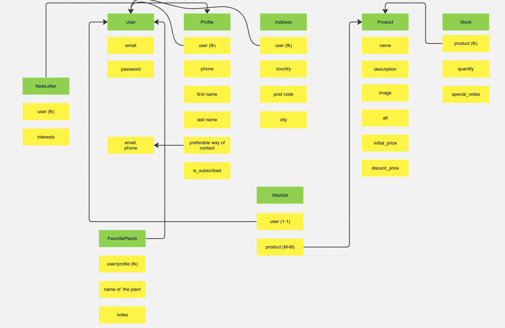

# E-commerce website

**Deployed website: [Link to website](https://ecommerce-project-uch6.onrender.com)**

**Card number for payment testing: 4242424242424242**
## About

"Shop Nature" is an e-commerce website that allows customers to buy plant products. It is a B2C platform, plant/store where the user can purchase plants. Using mainly Django, a Python back-end development framework and Bootstrap, front-end (CSS) framework wired up to Stripe, this project was brought to life. It has a login system, a shopping cart, a checkout system, and a payment system.

---

## UX

The website was created to be eye-catching and user-friendly. The user is given plenty of choices to choose from when they are shopping. The emphasis is on the user experience; the user can navigate the website easily to fulfill users' goals. The website is designed to be easy to use and easy to understand.

### **Project Goals**

 * Develop ShopNature website using Django and Bootstrap frameworks, wire up to Stripe
 * Present the website in a clean and easy to understand manner
 * Keep good UX principles regarding layout/colors/interaction
 * Robust Python code without issues/bugs
 * Fully responsive, interactive and with feedbacks

## **User Experience**

### **User Expectations**

 - Able to quickly understand what the purpose of the site is
 - Intuitive navigation
 - Responsive across many devices and screen sizes
 - Able to find basic information
 - Find additional info if needed
 - Every interaction has feedback
 - User-friendly
 - See the exact cost of every item
 - Easy and secure checkout
 - Contacting the store through the website
 - See what discounts are applied

### **User Stories**

Many user stories were developed for the project using Agile development methodology, for the full list please see the [CAG Project.](https://github.com/users/Boiann/projects/12 "Link to Cvek Art Gallery Project") The following stories are selected from that project, and are the more important ones.

#### **First Time Visitor**
 * [1](https://github.com/NikolettaGr/e-commerce/issues/1) I can open the home page, so that I can see what this website is about.
 * [2](https://github.com/NikolettaGr/e-commerce/issues/2) I can effectively explore this website, so that I can access all the info I need.
 * [3](https://github.com/NikolettaGr/e-commerce/issues/3) I can see a list of products, so that I can select one or more to purchase.
 * [4](https://github.com/NikolettaGr/e-commerce/issues/4) I can find out more about the store, so that I can find out more about them.
 * [5](https://github.com/NikolettaGr/e-commerce/issues/5) I can modify my shopping cart, so that I can adjust my purchase.
 * [6](https://github.com/NikolettaGr/e-commerce/issues/6) I can see a notification upon successful modifying/removing, so that I can know I'm doing things right.
 * [7](https://github.com/NikolettaGr/e-commerce/issues/7) I can connect with the store/business on Facebook so I can follow on any news/updates/special offers.
 * [8](https://github.com/NikolettaGr/e-commerce/issues/8) As a User I can send email to the store/owner, so that I can complain about the product,order or shipping.

#### **Returning Customer**
 * [9](https://github.com/NikolettaGr/e-commerce/issues/9) I want to be able to register and log in/out without issues.
 * [10](https://github.com/NikolettaGr/e-commerce/issues/10) I want to get an email notification so that my registration is confirmed.
 * [11](https://github.com/NikolettaGr/e-commerce/issues/11) I can search or sort by category of products, so that I can select one or more to purchase.
 * [12](https://github.com/NikolettaGr/e-commerce/issues/12) I can see if there is anything on special offer, so that I can save some money.
 * [13](https://github.com/NikolettaGr/e-commerce/issues/13) I can remove products from my shopping cart, so that I can adjust my purchase.
 * [14](https://github.com/NikolettaGr/e-commerce/issues/14) I can have personalized user profile so I can view my order history.
 * [15](https://github.com/NikolettaGr/e-commerce/issues/15) I can subscribe to the store newsletter so I can know about any news/updates/special offers.

#### **Website Admin/Owner**
* [16](https://github.com/NikolettaGr/e-commerce/issues/16) I can add/remove products from the store so I can remove sold out products and add new ones.
* [17](https://github.com/NikolettaGr/e-commerce/issues/17) I can modify products in the store so I can update them with the right details.
* [18](https://github.com/NikolettaGr/e-commerce/issues/18) I can see what the customer ordered, how much was paid, and was the discount applied.

## Business Model

The business operates on a Business-to-Consumer (B2C) model, meaning that it exclusively sells products directly to individual customers. The primary focus lies on facilitating individual transactions. The website is designed with simplicity and intuitiveness in mind, prioritizing a positive user experience (UX). Key features include easy sign-ups for newsletters, a user-friendly contact system, potential promotional deals, all aimed at attracting and expanding the customer base.

The business owner's objective is to establish a thriving eCommerce platform dedicated to selling plants. This involves creating a visually appealing website coupled with a seamless and secure payment system. Additionally, the owner should have the capability to efficiently manage inventory and make updates or changes through a secure and interactive front-end interface. This approach ensures a user-friendly experience for both customers and the business owner, fostering growth and success in the online plant-selling venture.

## Web Marketing

Newsletters were implemented in the newsletter app. The manager can create a newsletter and send it to all customers. To send a newsletter to all customers, the manager can create a newsletter and send it to all customers.
I have used Django EmailMultiAlternatives to send the newsletter.

2. Facebook

Facebook is essential for the store to be able to reach customers. According to the statistics, the store has a good reach among people who prefer to use Facebook. Facebook has excellent coverage worldwide among people who can purchase products online.

"Shop Nature" Facebook page is for marketing purposes to post adverts and exciting content and engage users.Link below:

[Shop Nature Facebook Page](https://www.facebook.com/profile.php?id=61554150725603)

## Future Development

#### Techsupport chat

Chat support is planned to be implemented to provide the customers with the best possible service.

My application is already using ASGI instead of WSGI. Thus, it would be easier to implement chat support using Django Channels and Redis channel layers in the future.

#### Third-party registration

Facebook and Twitter were not considered for future development at this stage as they require additional information from the business. 
Google is the most popular third-party registration service that is easy to implement; however, it is not available in all countries and regions.

#### Payment system

I want to implement PayPal payment system in the future as many customers prefer it.

#### Suppliers app

I want to add the suppliers' app in the future as it is a significant part of the business. The suppliers' app is a platform for businesses to manage suppliers and products they offer customers. It will highly increase the business' productivity and sales.
The models for this app have already been planned and described in the DB architecture tables.

#### Order cancellation

This feature requires more research time to implement, which is why it is not implemented at this stage.

#### Elastic search

Elastic search is necessary for the future development of the application as it may increase the search speed and the quality of search results.

This decision to postpone the this feature's implementation was necessary to make as a developer, I have to evaluate the necessity of all features and estimate the time for the development process and the time for the implementation of the features. Moreover, it is crucial to know the exact operating procedure of a real business. For example, understanding the business's product prioritization to set up the recommendation functionality will play a crucial role in the implementation process. Thus, I would like to leave those features as the opportunity to future learning and development.

#### Delivery cost calculation

This interesting feature has kept me curious during the development process as there are many different ways to calculate the delivery cost. At this stage, I decided to go with the idea of free delivery based in all Chinese e-commerce stores, where the cost is already included in the product's price. However, to make the application more flexible, I would like to consider the possibility of different delivery cost calculation methods and plan to consult with logistics specialists to get all the necessary information. We have to take into consideration various factors such as:

1. The shipping company fees;
2. the actual distance between a shop warehouse and the customer's address;
3. The total weight of the products in the order;
4. The parameters of the package (size, weight, etc.);
5. The value of the products in the order (whether the order includes golden jewelry, TV, etc.);
6. Payment method (whether the customer is paying with a credit card, PayPal, etc.);
7. Tax rate;
8. If the customer is located abroad, the border tax rate;
9. Option to deliver by courier or by self-service;
10. etc.

## Technologies used
- ### Languages:
    
    + [Python 3.11](https://www.python.org/downloads/release/python-385/): the primary language used to develop the server-side of the website.
    + [JS](https://www.javascript.com/): the primary language used to develop interactive components of the website.
    + [HTML](https://developer.mozilla.org/en-US/docs/Web/HTML): the markup language used to create the website.
    + [CSS](https://developer.mozilla.org/en-US/docs/Web/css): the styling language used to style the website.

- ### Frameworks and libraries:

    + [Django](https://www.djangoproject.com/): python framework used to create all the logic.
    + [jQuery](https://jquery.com/): was used to control click events and sending AJAX requests.
    + [jQuery User Interface](https://jqueryui.com/) was used to create interactive elements.

- ### Databases:

    + [SQLite](https://www.sqlite.org/): was used as a development database.
    + [PostgreSQL](https://www.postgresql.org/): the database used to store all the data.

- ### Other tools:

    + [Git](https://git-scm.com/): the version control system used to manage the code.
    + [Pip3](https://pypi.org/project/pip/): the package manager used to install the dependencies.
    + [Psycopg2](https://www.psycopg.org/): the database driver used to connect to the database.
    + [Django-allauth](https://django-allauth.readthedocs.io/en/latest/): the authentication library used to create the user accounts.
    + [Gunicorn](https://pypi.org/project/gunicorn/) - A Python Web Server Gateway Interface (WSGI) HTTP server.
    + [Django-crispy-forms](https://django-cryptography.readthedocs.io/en/latest/): was used to control the rendering behavior of Django forms.
    + [Render](https://pypi.org/project/render/): was used to render the README file.
    + [GitHub](https://github.com/): used to host the website's source code.
    + [VSCode](https://code.visualstudio.com/): the IDE used to develop the website.
    + [Chrome DevTools](https://developer.chrome.com/docs/devtools/open/): was used to debug the website.
    + [Font Awesome](https://fontawesome.com/): was used to create the icons used in the website.
    + [Draw.io](https://www.lucidchart.com/) was used to make a flowchart for the README file.
    + [W3C Validator](https://validator.w3.org/): was used to validate HTML5 code for the website.
    + [W3C CSS validator](https://jigsaw.w3.org/css-validator/): was used to validate CSS code for the website.
    + [JShint](https://jshint.com/): was used to validate JS code for the website.
    + [PEP8](https://pep8.org/): was used to validate Python code for the website.
    + [stripe](https://stripe.com/): was used to create the payment system.
    + [birme.net](https://www.birme.net/): was used to crop and center unsplash images.
    + [Sitemap Generator](https://www.xml-sitemaps.com/) was used to create the sitemap.xml file.
    + [urllib3](https://pypi.org/project/urllib3/) - A powerful HTTP client for Python, which provides features such as connection pooling, request retries, and more.
    + [Balsamiq](https://balsamiq.com/) - Used to create wireframes and website structure map for the project.
    + [LightHouse](https://developer.chrome.com/docs/lighthouse/overview/) - Used for testing performance.
    + [Mail-Temp](https://temp-mail.org/sv/) - Used for temporary email for testing the website.

---

## Features

Please refer to the [FEATURES.md](FEATURES.md) file for all test-related documentation.

---

## **Design**

### **Color Scheme**

The color scheme utilized in the project intentionally avoids explicit definition, relying on Bootstrap CSS class selectors and templates inspired by the Boutique Ado project. This design choice aims to uphold a clean and cohesive site appearance. Notably, color accents are introduced to enhance user experience standards: red signifies cancellation, while green indicates confirmation. Additionally, shades of green are incorporated to establish a connection with nature. Bootstrap toasts contribute to color-coded messaging: blue for informational updates, yellow for warnings, red for alerts, and green for successful operations.

All the images of paproducts were taken from [Lively Root website](https://www.livelyroot.com/).

### Wireframes

  [Shop Nature Wireframes]()

### **Database Design**

Multiple apps and classes/models were created for the project, each one supporting the full site functionality.
 
 #### Cart app - no classes and models, primarily focused on cart calculations

 #### Checkout app - Order and OrderLineItem models

   - Order model:

|Name|Database Key|Field Type|Validation|
|---|---|---|---|
|order_number|order_number|CharField|max_length=32, null=False, editable=False|
|user_profile|user_profile|ForeignKey|'UserProfile', null=True, blank=True, on_delete=models.SET_NULL, related_name='orders'|
|full_name|full_name|CharField|max_length=50, null=False, blank=False|
|email|email|EmailField|max_length=254, null=False, blank=False|
|phone_number|phone_number|CharField|max_length=20, null=False, blank=False|
|country|country|CountryField|blank_label='Country *', null=False, blank=False|
|postcode|postcode|CharField|max_length=20, null=True, blank=True|
|town_or_city|town_or_city|CharField|max_length=40, null=False, blank=False|
|street_address1|street_address1|CharField|max_length=80, null=False, blank=False|
|street_address2|street_address2|CharField|max_length=80, null=True, blank=True|
|county|county|CharField|max_length=80, null=True, blank=True|
|date|date|DateTimeField|auto_now_add=True|
|delivery_cost|delivery_cost|DecimalField|max_digits=6, decimal_places=2, null=False, default=0|
|order_total|order_total|DecimalField|max_digits=10, decimal_places=2, null=False, default=0|
|grand_total|grand_total|DecimalField|max_digits=10, decimal_places=2, null=False, default=0|
|discount_applied|discount_applied|BooleanField|default=False|
|original_cart|original_cart|TextField|null=False, blank=False, default=''|
|stripe_pid|stripe_pid|CharField|max_length=254, null=False, blank=False, default=''|

   - OrderLineItem model:

|Name|Database Key|Field Type|Validation|
|---|---|---|---|
|order|order|ForeignKey|'Order', null=False, blank=False, on_delete=models.CASCADE, related_name='lineitems'|
|painting|painting|ForeignKey|'Painting', null=False, blank=False, on_delete=models.CASCADE|
|frame|frame|CharField|max_length=20, null=True, blank=True|
|lineitem_total|lineitem_total|DecimalField|max_digits=6, decimal_places=2, null=False, blank=False, editable=False|

 #### Shop Nature - main/root app

 #### Home app - focused on the index page display and function

 #### Products app - holding Category, Product, Stock, FavouritePlant

   - Category model:

| Name          | Database Key  | Field Type    | Validation     |
| ------------- | ------------- | ------------- | -------------- |
| name          | name          | CharField     | max_length=254 |
| friendly_name | friendly_name | CharField     | max_length=254, null=True, blank=True |

   - Product model:

| Name        | Database Key  | Field Type        | Validation                |
| ----------- | ------------- | ----------------- | ------------------------- |
| category    | category      | ForeignKey        | 'Category', null=True, blank=True, on_delete=models.SET_NULL |
| sku         | sku           | CharField         | max_length=254, null=True, blank=True |
| name        | name          | CharField         | max_length=254            |
| description | description   | TextField         |                           |
| price       | price         | DecimalField      | max_digits=6, decimal_places=2 |
| rating      | rating        | DecimalField      | max_digits=6, decimal_places=2, null=True, blank=True |
| image       | image         | ImageField        | null=True, blank=True     |

   - Stock model:

| Name          | Database Key  | Field Type    | Validation     |
| ------------- | ------------- | ------------- | -------------- |
| product       | product       | ForeignKey    | 'Product', on_delete=models.CASCADE |
| quantity      | quantity      | IntegerField  |                |
| special_notes | special_notes | CharField     | max_length=1000,null=True, blank=True |

   - FavouritePlant model:

| Name          | Database Key  | Field Type    | Validation     |
| ------------- | ------------- | ------------- | -------------- |
| user          | user          | ForeignKey    | get_user_model(), on_delete=models.CASCADE |
| plant_name    | plant_name    | CharField     | max_length=100, null=True, blank=True |
| notes         | notes         | CharField     | max_length=1000, null=True, blank=True |

 #### Profiles app - where UserProfile model is defined

   - UserProfile model:

| Name                   | Database Key            | Field Type        | Validation                  |
| ---------------------- | ----------------------- | ----------------- | --------------------------- |
| user                   | user                    | OneToOneField     | 'User', on_delete=models.CASCADE |
| default_phone_number   | default_phone_number    | CharField         | max_length=20, null=True, blank=True |
| default_street_address1| default_street_address1 | CharField         | max_length=80, null=True, blank=True |
| default_street_address2| default_street_address2 | CharField         | max_length=80, null=True, blank=True |
| default_town_or_city   | default_town_or_city    | CharField         | max_length=40, null=True, blank=True |
| default_county         | default_county          | CharField         | max_length=80, null=True, blank=True |
| default_postcode       | default_postcode        | CharField         | max_length=20, null=True, blank=True |
| default_country        | default_country         | CountryField      | blank_label='Country', null=True, blank=True |

 #### Support app - Contact class used for contacting the store

   - Contact model:

| Name             | Database Key     | Field Type    | Validation                                 |
| ---------------- | ---------------- | ------------- | ------------------------------------------ |
| contact_reason   | contact_reason   | CharField     | max_length=24, choices=CONTACT_REASONS    |
| name             | name             | CharField     | max_length=100                             |
| email            | email            | EmailField    | max_length=100                             |
| phone            | phone            | CharField     | max_length=20, blank=True, null=True       |
| message          | message          | TextField     | max_length=1000                            |
| date_submitted   | date_submitted   | DateTimeField | auto_now_add=True                         |

#### Wishlist app - When the user signs up, a new wishlist is created

   - Wishlist model:

| Name          | Database Key  | Field Type    | Validation |
| ------------- | ------------- | ------------- | ---------- |
| user          | user          | ForeignKey   | User, on_delete=models.CASCADE, related_name='wishlist', verbose_name='User' |
| products      | products      | ManyToManyField | Product, blank=True, related_name='wishlist', verbose_name='Products' |
| created_at    | created_at    | DateTimeField | auto_now_add=True, verbose_name='Created at' |

#### SubscribeUsers

   - Newsletter models:

| Name          | Database Key  | Field Type    | Validation |
| ------------- | ------------- | ------------- | ---------- |
| email         | email         | EmailField    | max_length=250 |
| created_at    | created_at    | DateTimeField | auto_now_add=True, verbose_name='Created at' |

#### EmailNewsNotification Model

| Name          | Database Key  | Field Type    | Validation |
| ------------- | ------------- | ------------- | ---------- |
| email_name    | email_name    | CharField    | max_length=100, null=False, unique=True, blank=False, verbose_name='Email name' |
| content       | content       | TextField    | null=False, blank=False, verbose_name='Content' |
| created_at    | created_at    | DateTimeField | auto_now_add=True, verbose_name='Created at' |

---

## Agile Methodology

### GitHub Project Management

  

GitHub Project Management was used to manage the project. If it hadn't been for the GitHub project management, I wouldn't have been able to manage the development of the application. It helped me to prioritize the tasks and to keep track of my progress.

---

## Flowchart

---
## Testing

Please refer to the [TESTING.md](TESTING.md) file for all test-related documentation.

---

## Deployment and Payment setup

- The app was deployed to [Render](https://render.com/).
- The database was deployed to [ElephantSQL](https://www.elephantsql.com/).

- The app can be reached by the [link](https://ecommerce-project-uch6.onrender.com).

Please refer to the [DEPLOYMENT.md](DEPLOYMENT.md) file for all deployment and payment-related documentation.

---

## Credits

- [GitHub](https://github.com/) for giving the idea of the project's design.
- [Django](https://www.djangoproject.com/) for the framework.
- [Font awesome](https://fontawesome.com/): for the free access to icons.
- [Boutique Ado](https://github.com/NikolettaGr/Boutique-Ado-fullstack) The Code Institute's walkthrough project provided a lot of the site's original functionality, direction and design choices that were modified and expanded as needed. It was relied on heavily during whole development process and a lot of code is used directly from it, or with changes/updates to it.
- [Render](https://render.com/): for providing a free hosting.
- [jQuery](https://jquery.com/): for providing varieties of tools to make standard HTML code look appealing.
- [jQuery UI](https://jqueryui.com/): for providing varieties of tools to make standard HTML code look appealing.
- [Postgresql](https://www.postgresql.org/): for providing a free database.
- [Stripe](https://stripe.com/): for providing a free payment gateway.
- [Very Academy Youtube Channel](https://www.youtube.com/c/veryacademy): for brilliant tutorials, which shed the light on the implementation of database with multi-values products, precise explanations of the stripe API, and many other things!
- [fontawesome](https://fontawesome.com/): for providing free icons.
- [googlefonts](https://fonts.google.com/): for providing free fonts.
- [Responsive Viewer](https://chrome.google.com/webstore/detail/responsive-viewer/inmopeiepgfljkpkidclfgbgbmfcennb/related?hl=en): for providing a free platform to test website responsiveness
- [GoFullPage](https://gofullpage.com/): for allowing to create free full web page screenshots;
- [Favicon Generator. For real.](https://realfavicongenerator.net/): for providing a free platform to generate favicons.
- [Sitemap Generator](https://www.xml-sitemaps.com/): for providing a free platform to generate sitemaps.
- [Mail-Temp](https://temp-mail.org/sv/): used for temporary email for testing the website.
 -[Stack Overflow](https://stackoverflow.com/questions/71523700/how-to-implement-category-subcategory-and-product-in-django): found how to implement Category and Product in django.

### Content and Images

- [unsplash](https://unsplash.com/): for providing a free images for the website.
- [chrome developer tools](https://developer.chrome.com/extensions/devtools_inspector): for providing a free platform to test website.
- [Lovely Root](https://www.livelyroot.com/): for downloading products images.
---

## Acknowledgments

- [Iuliia Konovalova](https://github.com/IuliiaKonovalova) was a great supporter of another bold idea of mine for this project. Iuliia guided me through the development of the project and helped me to learn a lot of new things by challenging me to do something new.
- My friend, assisted me greatly in product values js selection control implementation and helped me to stay sane.
- [Very Academy Youtube Channel](https://www.youtube.com/c/veryacademy) provided great insight on the implementation of the database with multi-values products, precise explanations of the stripe API, and many other things! This Youtube channel has plenty of brilliant tutorials that shed light on Django's most curious and useful aspects.