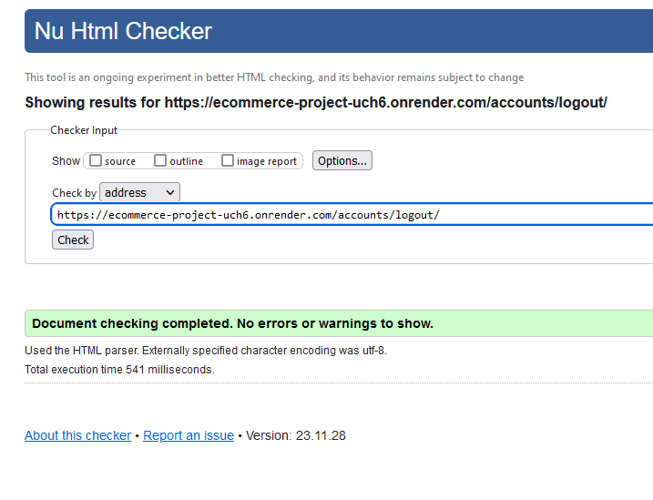
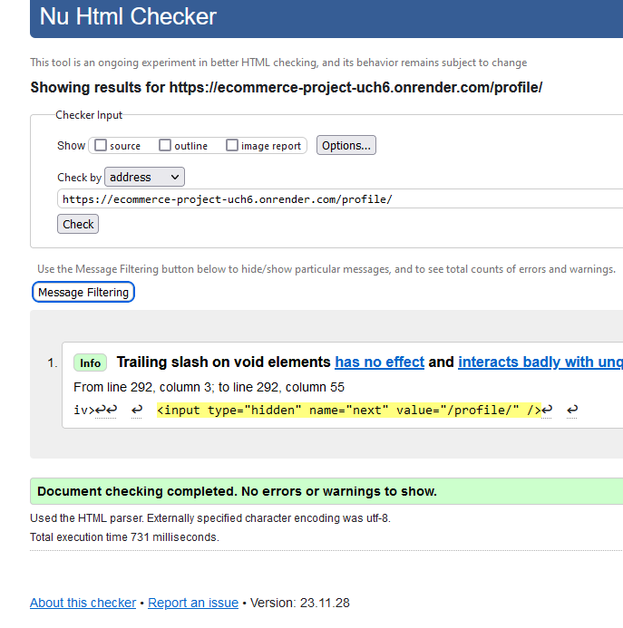
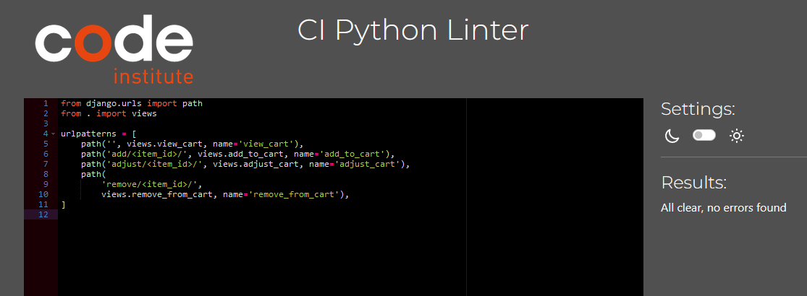
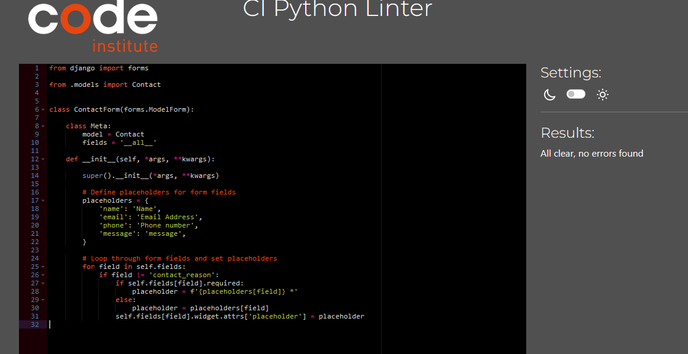

# **Shop Nature - Testing** 

[Main README.md file](/README.md)

Visit the live site - [Shop Nature](https://ecommerce-project-uch6.onrender.com "Link to Shop Nature website")

View GitHub [Repository](https://github.com/NikolettaGr/e-commerce)

## Automated Testing

### **W3C HTML Validator**

The [HTML W3C HTML Validator](https://validator.w3.org/#validate_by_uri+with_options) was used to validate the HTML code used, showing no errors.

HTML Validation:

 - Index
  

 - Products
  

  I removed spaces between the friendly name ,but still the validator detecting the same error.

 - Cart
  

 - Checkout
  

 - Checkout success
  

  - Newsletter
  

  - About the Artist
  

  - Contact Us
  

 - Log in
  

 - Log out
  

 - Register
  

 - My Profile
  

 - Add Product
  

- Wishlist
  

---

### **W3C CSS Validator**

The [CSS Jigsaw CSS Validator](https://jigsaw.w3.org/css-validator/#validate_by_uri) was used to validate the CSS code used, showing no errors.

CSS Validation:

---

### **JSHINT Javascript Validator**

The [JsHint](https://jshint.com/) was used to validate the Javascript code used, showing no errors.

Javascript Validation:

---

### **CI Python Linter**

The [CI Python Linter](https://pep8ci.herokuapp.com/) was used to validate the Python code used, showing no errors.

---

#### Cart App

Cart App Validation:

 - contexts.py
  

 - urls.py
  

 - views.py
  

---

#### Checkout App

Checkout App Validation:

 - admin.py
  

 - forms.py
  

 - models.py
  

 - signals.py
  

 - urls.py
  

 - views.py
  

---

#### Home App

Home App Validation:

 - urls.py
  

 - views.py
  

---

#### Products App

Products App Validation:

 - admin.py
  

 - forms.py
  

 - models.py
  

 - urls.py
  

 - views.py
  

---

#### Profiles App

Profiles App Validation:

 - forms.py
  

 - models.py
  

 - urls.py
  

 - views.py
  

---

#### Support App

Support App Validation:

 - forms.py
  

 - models.py
  

 - urls.py
  

 - views.py
  

---

#### Wishlist App

Wishlist App Validation:

 - models.py
  

 - urls.py
  

 - views.py
  

---

## **Manual Testing**

### **Testing User Stories**

#### **First Time Visitor**

| User Story | Pass/Fail |
|------------|----------|
| I can open the home page so that I can see what this website is about. | PASS |
| I can effectively explore this website so that I can access all the info I need. | PASS |
| I can see a list of products so that I can select one or more to purchase. | PASS |
| I can find out more about the store so that I can find out more about them. | PASS |
| I can modify my shopping cart so that I can adjust my purchase. | PASS |
| I can see a notification upon successful modifying/removing so that I can know I'm doing things right. | PASS |
| I can connect with the store/business on Facebook so I can follow on any news/updates/special offers. | PASS |

#### **Returning Customer**

| User Story | Pass/Fail |
|------------|----------|
| I want to be able to register and log in/out without issues. | PASS |
| I want to get an email notification so that my registration is confirmed. | PASS |
| I can search or sort by category of paintings so that I can select one or more to purchase. | PASS |
| I can see if there is anything on special offer so that I can save some money. | PASS |
| I can add and see my wishlist so, that I can save products which I like. | PASS |
| I can remove products from my shopping cart so that I can adjust my purchase. | PASS |
| I can have personalized user profile so I can view my order history. | PASS |
| I can subscribe to the store newsletter so I can know about any news/updates/special offers. | PASS |

#### **Website Admin/Owner**

| User Story | Pass/Fail |
|------------|----------|
| I can add/remove products from the store so I can remove sold out products and add new ones. | PASS |
| I can modify products in the store so I can update them with the right details. | PASS |
| I can see what the customer ordered, how much was paid, and was the discount applied. | PASS |

---

## **Bugs**

### **Known Bugs**

* No known bugs present in the project (disclaimer; that doesn't mean there are none) at the time of writing this readme/testing.

There were many 'small' bugs that had to be dealt with during the development of the project. Most of them were squashed by doing a quick [Google](https://google.com/ "Google home page") search and using [Stack Overflow](https://stackoverflow.com/ "Stack Overflow home page") to find relevant solutions.

One of the major hurdles faced during the development process stemmed from the use of a temporary email address for Stripe integration. This choice led to persistent issues with the checkout process, consistently resulting in errors related to an invalid API key. The intricacies of this problem were not extensively outlined, especially in the case of AWS connectivity, as it presented a significant source of concern and urgency nearing the submission deadline.

- First major bug was encountered while implementing Stripe. It took multiple days and tries for this to be solved, and it took away time from further development. The code was updated and reworked multiple times because there was lack of attention to details and testing scope on the developer's part. That bug lead directly to other one with the database. After overloading the code with `print()` statements, it was fixed.

- Forcing sku as unique identifier instead of painting_id was a mistake in retrospect, this caused additional time spent when reworking the code to use painting_id. This change necessity became apparent when trying to implement adding new paintings as admin. When using SKU-s, when SKU field was left empty when submitting new painting, nothing worked because SKU was missing and not automatically generated, and painting_id is.

- Search functionality was not working as it should, returning nothing if searched term was category which was solved and fixed quickly.

- Deployment Issue - Media Files Dysfunction

During the deployment phase, a critical challenge emerged related to the proper functioning of media files. Despite numerous attempts to rectify the situation, the images and media assets failed to load as expected on the deployed site. This issue became a source of frustration and consumed considerable time and effort in debugging and troubleshooting.

In the course of grappling with the problem, seeking guidance from the mentor, and consulting various resources, a breakthrough came with the suggestion to leverage Cloudinary for media storage. The decision to adopt Cloudinary as a solution for handling media assets proved to be pivotal in resolving the persistent issue and ensuring the seamless deployment of the project. This experience underscored the importance of exploring alternative strategies and seeking expert advice to overcome deployment hurdles effectively.

