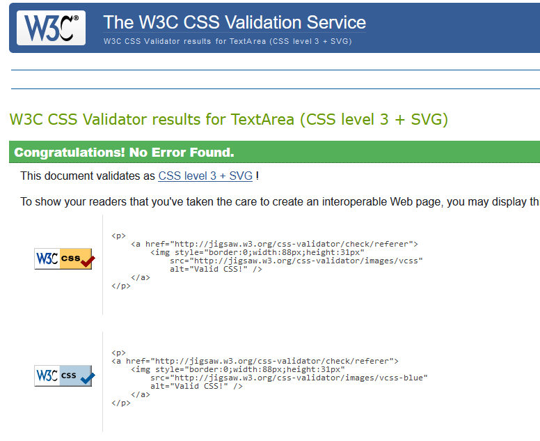
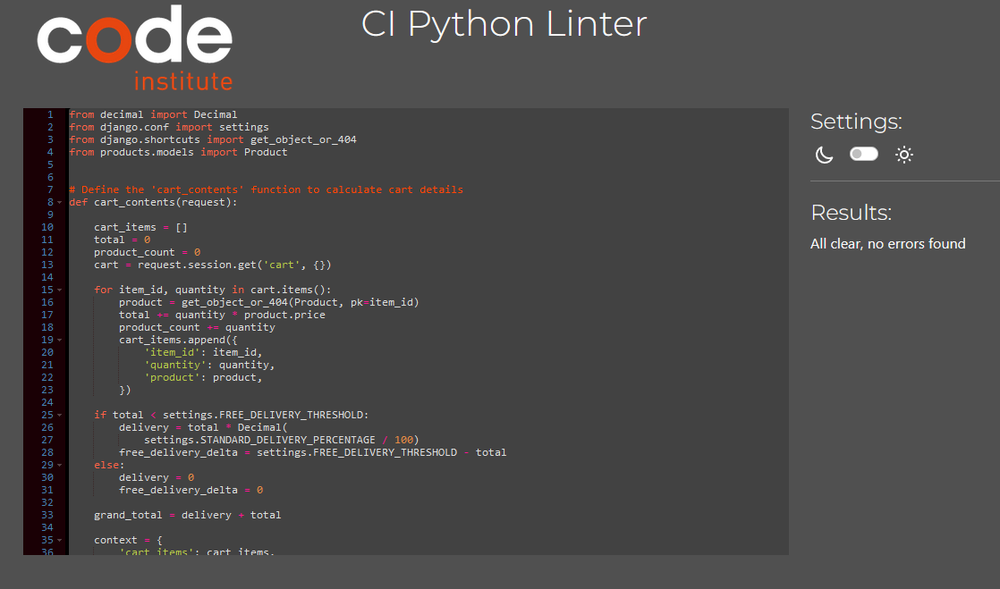
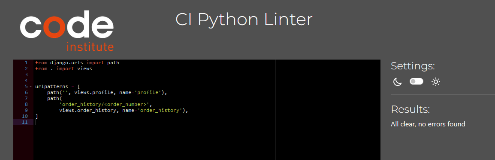
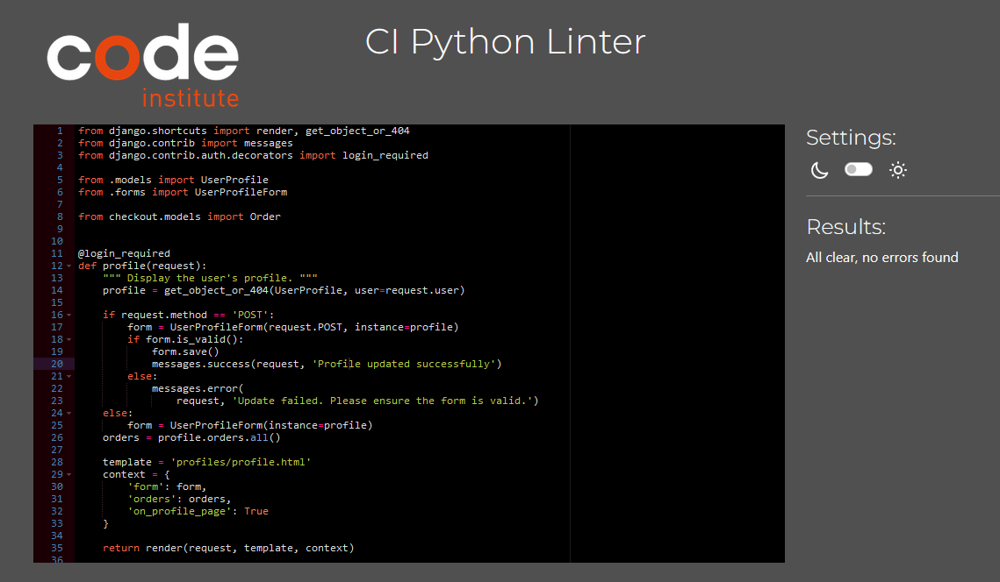
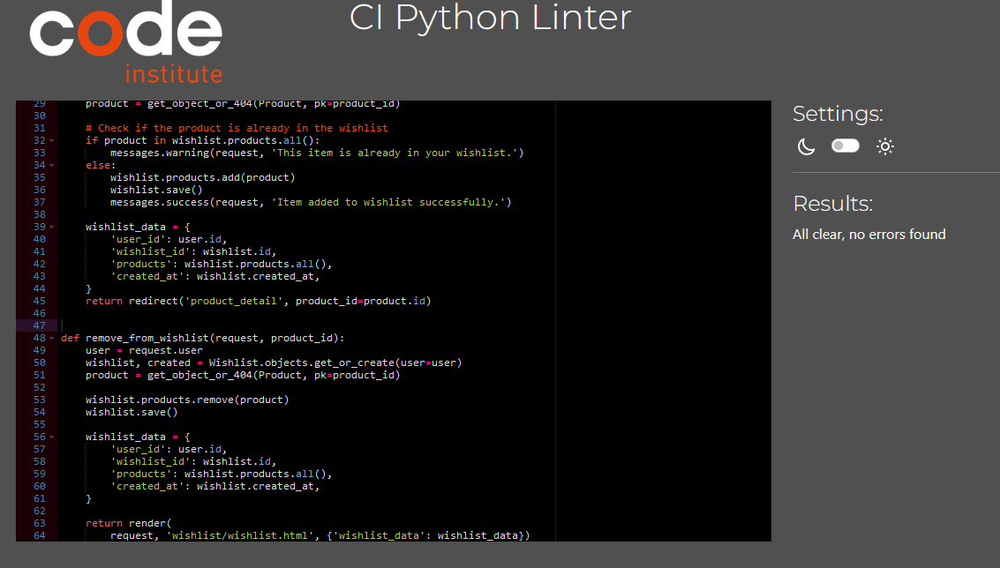

# **Shop Nature - Testing** 

[Main README.md file](/README.md)

Visit the live site - [Shop Nature](https://ecommerce-project-uch6.onrender.com "Link to Shop Nature website")

View GitHub [Repository](https://github.com/NikolettaGr/e-commerce)

## Automated Testing

### **W3C HTML Validator**

The [HTML W3C HTML Validator](https://validator.w3.org/#validate_by_uri+with_options) was used to validate the HTML code used, showing no errors.

HTML Validation:

 - Index
  

 - Products
  

  I removed spaces between the friendly name ,but still the validator detecting the same error.

 - Cart
  

 - Checkout
  

 - Checkout success
  

  - Newsletter
  

  - About the Artist
  

  - Contact Us
  

 - Log in
  

 - Log out
  

 - Register
  

 - My Profile
  

 - Add Product
  

- Wishlist
  

---

### **W3C CSS Validator**

The [CSS Jigsaw CSS Validator](https://jigsaw.w3.org/css-validator/#validate_by_uri) was used to validate the CSS code used, showing no errors.

CSS Validation:

---

### **JSHINT Javascript Validator**

The [JsHint](https://jshint.com/) was used to validate the Javascript code used, showing no errors.

Javascript Validation:

---

### **CI Python Linter**

The [CI Python Linter](https://pep8ci.herokuapp.com/) was used to validate the Python code used, showing no errors.

---

#### Cart App

Cart App Validation:

 - contexts.py
  

 - urls.py
  

 - views.py
  

---

#### Checkout App

Checkout App Validation:

 - admin.py
  

 - forms.py
  

 - models.py
  

 - signals.py
  

 - urls.py
  

 - views.py
  

---

#### Home App

Home App Validation:

 - urls.py
  

 - views.py
  

---

#### Products App

Products App Validation:

 - admin.py
  

 - forms.py
  

 - models.py
  

 - urls.py
  

 - views.py
  

---

#### Profiles App

Profiles App Validation:

 - forms.py
  

 - models.py
  

 - urls.py
  

 - views.py
  

---

#### Support App

Support App Validation:

 - forms.py
  

 - models.py
  

 - urls.py
  

 - views.py
  

---

#### Wishlist App

Wishlist App Validation:

 - models.py
  

 - urls.py
  

 - views.py
  

---
